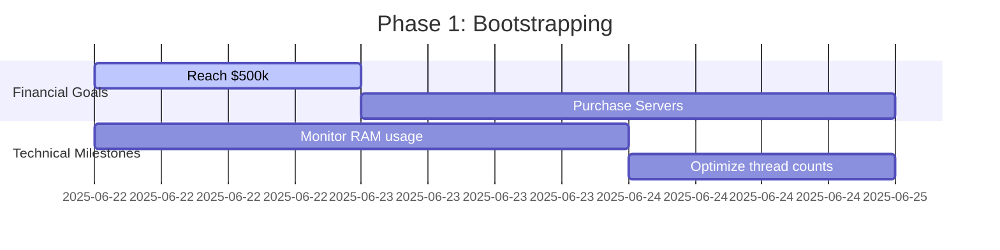
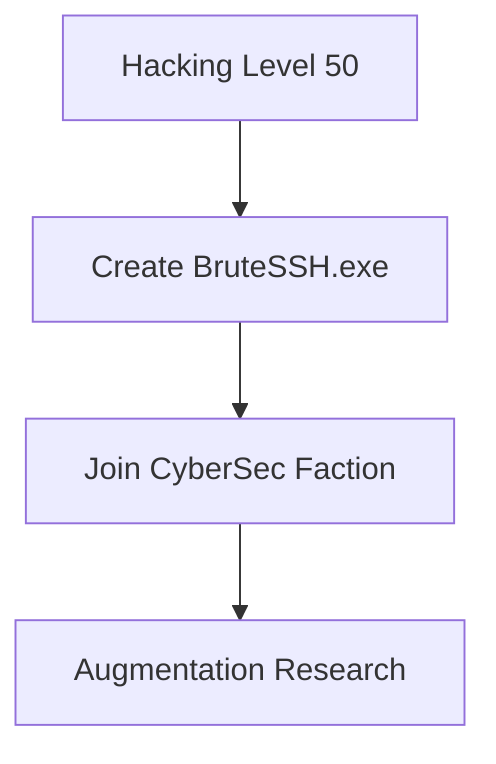

# OPERATION LOG: CYBER PROGRESSION TRACKER

## CURRENT MISSION STATUS


## ACTIVE ASSETS
### 1. Enhanced Hacking Script (`enhanced-hack.js`)
- **Purpose**: Adaptive server targeting and resource draining
- **Key Features**:
  - Dynamic target selection based on profitability
  - Real-time status monitoring
  - Security management system
- **JavaScript Concepts**:
  ```javascript
  // Asynchronous operations with await
  await ns.hack(target);
  
  // Higher-order array methods
  servers.filter(server => condition);
  
  // Modular function design
  function findOptimalTarget() {...}
  ```

### 2. Deployment System (`deploy-hacknet.js`)
- **Purpose**: Automated script distribution across network
- **Key Features**:
  - Network scanning and discovery
  - Resource-aware deployment
  - Failure reporting
- **Technical Implementation**:
  ```javascript
  // Recursive server scanning
  function scanServer(host) {
    ns.scan(host).forEach(server => {...});
  }
  
  // Resource calculation
  const threads = Math.floor(availableRAM / scriptRAM);
  ```

## NEXT PHASES: OPERATION SCALING

### Phase 1: Resource Expansion ($0-$1M)


**Actions:**
- Run deployment: `run deploy-hacknet.js`
- At $550k: Buy first 8GB server
- At $1M: Upgrade home RAM at Alpha Enterprises

### Phase 2: CyberSec Infiltration (Lvl 50+)


**Preparation Script:**
```javascript
// Fragment from upcoming faction-intel.js
ns.workForFaction("CyberSec", "Hacking Contracts");
```

### Phase 3: Advanced Operations
- **Stock Market Algorithms**: Develop trading bots
- **Corporate Espionage**: Infiltrate company networks
- **Augmentation Optimization**: Smart upgrade sequencing

## TECHNICAL ANNEX: KEY JAVASCRIPT PATTERNS
### 1. Asynchronous Control Flow
```javascript
while(true) {
  await performOperation(); // Non-blocking loop
}
```

### 2. Functional Programming
```javascript
// Pure function example
const calculateValue = (max, difficulty) => max * (myLevel/difficulty);
```

### 3. Error Handling
```javascript
try {
  riskyOperation();
} catch (error) {
  ns.tprint(`RED ALERT: ${error}`); // In-character alerts
}
```

## ACTIVE COMMANDS
```terminal
# Deploy network
run deploy-hacknet.js

# Check script RAM usage
mem enhanced-hack.js

# Discover new targets
scan-analyze 3
```

> OPERATIONAL NOTE: Execute deployment script after any significant network change (new servers, augmentations, etc.)
